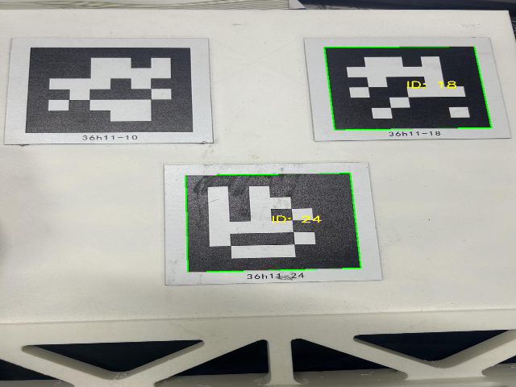
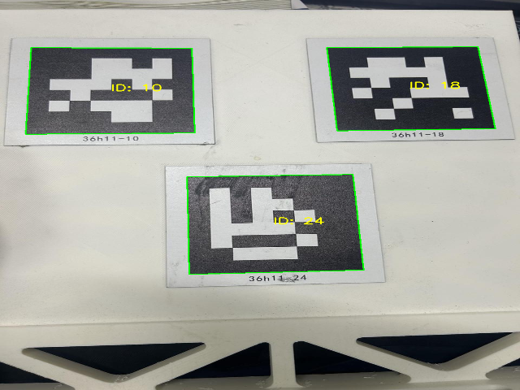
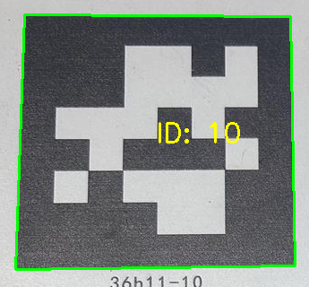

# 附加作业说明

在未连接相机的情况下，尝试了使用作业pdf提供的原始照片作为输入，识别图中的opencv标志。测试时除了图像来源、候选轮廓距离阈值`minMarkerDistanceRate`配置，其余核心实现均与作业`opencv.cpp`一致。

原始情况下`minMarkerDistanceRate`使用OpenCV默认值`0.05`，检测到ID18、24，ID10漏检。

将`minMarkerDistanceRate`改为`0.02`后，ID10、18、24均被识别，且每个标记只检测到一次。

- 原因可能是在这张照片内标记边框和外层纸张边框被当成重复候选，真正的标记边框被筛掉了
- 裁掉外层纸张边缘后，使用默认参数，也能识别ID10
